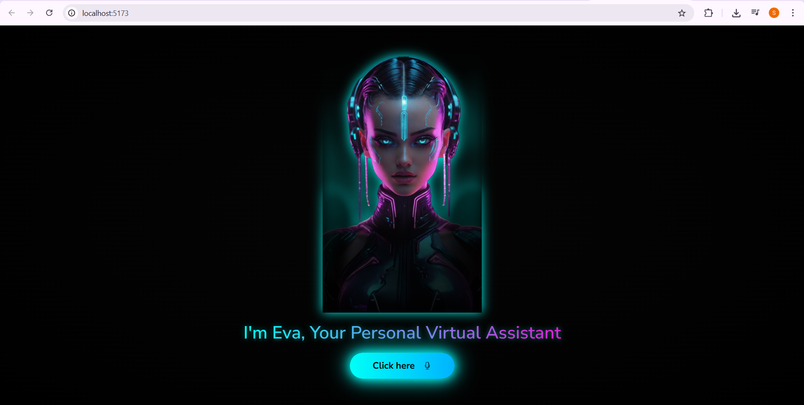

# Eva - AI Virtual Assistant




Eva is a modern AI-powered virtual assistant designed to interact intelligently with users, respond to queries, and provide seamless assistance. Built with React, Vite, and Tailwind CSS, Eva offers a beautiful and responsive interface.

---

# -------------------------
# Author: Shaurya Pratap Singh
# -------------------------


## 🚀 Features
- **Real-time AI Responses** – Intelligent answers using AI models.
- **Voice Interaction** – Can listen and speak back to the user.
- **Modern UI** – Built with React + Vite + Tailwind CSS for performance.
- **Customizable** – Easily extendable and configurable.

---

## 📦 Installation

Follow these steps to set up and run Eva locally:

### 1. Clone the Repository
```bash
git clone https://github.com/shauryaa-tech/Eva.git
cd Eva
```

### 2. Install Dependencies
Make sure you have **Node.js (>=16)** installed. Then, install all dependencies:
```bash
npm install
```

### 3. Start the Development Server
```bash
npm run dev
```

### 4. Build for Production
```bash
npm run build
```

---

## 📁 Project Structure
```
Eva/
├── public/          # Static files
├── src/             # Source code
│   ├── components/  # UI components
│   ├── assets/      # Images & icons
│   └── main.jsx     # App entry point
├── package.json     # Dependencies & scripts
└── README.md        # Documentation
```

---

## 👨‍💻 Author
**Shaurya Pratap Singh**  
GitHub: [shauryaa-tech](https://github.com/shauryaa-tech)

---

## 📜 License & Copyright
© 2025 Shaurya Pratap Singh. All rights reserved.  
This project is protected under copyright law.  
Unauthorized copying or redistribution of any part of this project is prohibited.

---

## ⭐ Contributing
We welcome contributions! Fork the repo and create a pull request for any feature or fix you'd like to add.

---

## 💌 Contact
For queries or suggestions, reach out at: **shaurya13822@gmail.com**

